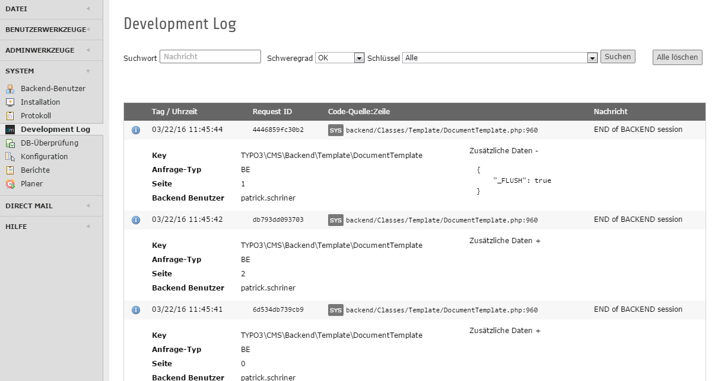

.. ==================================================
.. FOR YOUR INFORMATION
.. --------------------------------------------------
.. -*- coding: utf-8 -*- with BOM.

.. include:: ../Includes.txt

.. _about:

What does it do?
================
This extension implements hooks into TYPO3 CMS devlog hook to capture devlog entries.
It provides a backend module for easy access to those log entries.

- Based on extbase & fluid
- Tries to adhere to TYPO3 CMS UI standards
- Supports 7.6 LTS and 8.0 Dev (and 6.2)

.. figure:: ../Images/Module/ModuleBootstrap.png
  :alt: TYPO3 7.6+ Backend.

- There is a simplified but functionally equivalent backend module for TYPO3 6.2

