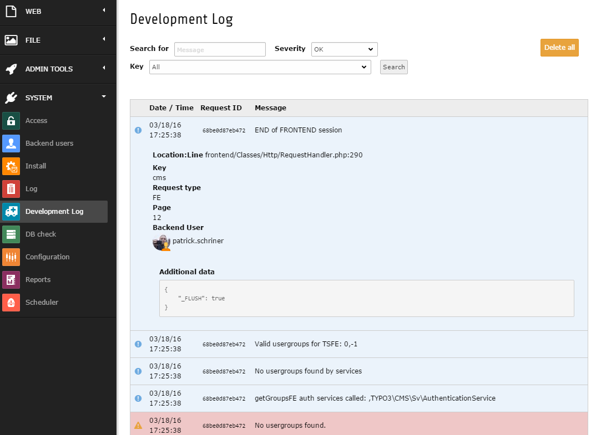

.. ==================================================
.. FOR YOUR INFORMATION
.. --------------------------------------------------
.. -*- coding: utf-8 -*- with BOM.

.. include:: ../Includes.txt

.. _about:

What does it do?
================

This extension implements hooks into TYPO3 CMS devlog hook to capture devlog entries.
It provides a backend module for easy access to those log entries.

- Based on extbase & fluid
- Tries to adhere to TYPO3 CMS UI standards
- Supports 8.7 LTS and 9.5 LTS and 10.4 LTS

Table Garbage Collector Task
^^^^^^^^^^^^^^^^^^^^^^^^^^^^

When a table garbage collector task is configured this extension will hook into it's configuration to automatically delete old data.